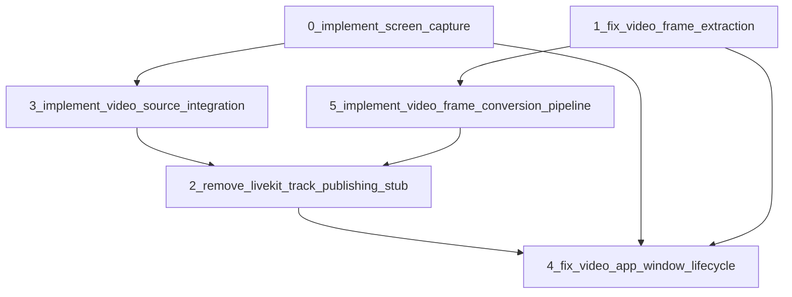

# Video Processing Infrastructure Tasks

**Milestone**: 1_video_processing_infrastructure  
**Priority**: ⚠️ HIGH (Core Application Functionality)  
**Estimated Total Effort**: 50-65 hours  

## Overview

This milestone establishes the complete video processing pipeline for fluent-voice, enabling camera capture, screen sharing, and real-time video streaming through LiveKit integration. All tasks focus on removing runtime panics, silent failures, and code quality violations while implementing production-ready video functionality.

## Task Dependencies

## Task Breakdown

### Critical Path Tasks
1. **[0_implement_screen_capture.md](./0_implement_screen_capture.md)** - Remove runtime panics from screen capture
   - **Priority**: 🚨 CRITICAL (Runtime Panic)
   - **Effort**: 10-12 hours
   - **Blocks**: VideoSource integration, application lifecycle

2. **[2_remove_livekit_track_publishing_stub.md](./2_remove_livekit_track_publishing_stub.md)** - Fix code quality violation  
   - **Priority**: 🚨 CRITICAL (Code Quality)
   - **Effort**: 6-8 hours
   - **Blocks**: Video streaming functionality

### High Priority Tasks  
3. **[3_implement_video_source_integration.md](./3_implement_video_source_integration.md)** - Complete camera/screen source implementation
   - **Priority**: ⚠️ HIGH (Core Functionality)
   - **Effort**: 12-15 hours
   - **Enables**: All video capture functionality

4. **[4_fix_video_app_window_lifecycle.md](./4_fix_video_app_window_lifecycle.md)** - Complete application event handling
   - **Priority**: ⚠️ HIGH (Core Application Flow)  
   - **Effort**: 10-12 hours
   - **Enables**: User interface and interaction

5. **[5_implement_video_frame_conversion_pipeline.md](./5_implement_video_frame_conversion_pipeline.md)** - Video format conversion pipeline
   - **Priority**: ⚠️ HIGH (Core Data Processing)
   - **Effort**: 16-20 hours
   - **Enables**: LiveKit integration and video quality

### Medium Priority Tasks
6. **[1_fix_video_frame_extraction.md](./1_fix_video_frame_extraction.md)** - Fix silent video frame failures
   - **Priority**: 🔇 MEDIUM (Silent Failure)
   - **Effort**: 8-10 hours
   - **Improves**: Video quality and debugging

## Research Foundation

Comprehensive research has been conducted on the existing codebase and available resources:

### Core Issues Identified
- **Runtime Panic**: `unimplemented!()` in screen capture causes crashes
- **Code Quality Violation**: Explicit stubbing violates CLAUDE.md standards  
- **Silent Failures**: Black video frames with no error indication
- **Incomplete Integration**: VideoSource methods not fully implemented
- **Missing Event Handling**: Application lifecycle lacks proper window management

### Available Resources
- **Local Dependencies**: All necessary libraries available in `./tmp/`
  - `core-video/` - macOS Core Video integration patterns
  - `screenshots-rs/` - Cross-platform screen capture reference
  - `scrap/` - Alternative screen capture implementation
  - `cudarc/` - CUDA acceleration for video processing
  - `cpal/` - Audio/video I/O reference
- **Existing Infrastructure**: LiveKit integration framework already in place
- **Hardware Acceleration**: Metal and CUDA support available in workspace

### Implementation Patterns Discovered
- **LiveKit Integration**: Working audio track publishing pattern in `livekit_client.rs:84-100`
- **VideoTrack API**: Functional frame stream interface in `video/src/track.rs:112-133`
- **Core Video Patterns**: Buffer locking and format detection in Core Video examples
- **Application Structure**: Window lifecycle framework in `video/src/main.rs:70-112`

## Success Criteria

### Functional Requirements
- [ ] Screen capture works without runtime panics
- [ ] Camera capture produces real video frames (not black placeholders)
- [ ] LiveKit video streaming publishes actual video tracks
- [ ] Application responds to window events (resize, keyboard, close)
- [ ] Video format conversion supports common formats (YUV, RGBA)
- [ ] Performance meets real-time constraints (60fps processing)

### Code Quality Requirements  
- [ ] No `unimplemented!()` panics remain in video paths
- [ ] No stubbing violations or placeholder comments
- [ ] No `#[allow(dead_code)]` suppressions remain
- [ ] All code passes `cargo check --message-format short --quiet`
- [ ] Production-quality error handling with meaningful messages
- [ ] Comprehensive test coverage for all video functionality

### Performance Requirements
- [ ] 1080p@60fps processing with <16ms per frame latency
- [ ] 4K@60fps with hardware acceleration when available
- [ ] Memory usage stable during extended video processing
- [ ] Screen capture completes within 50ms for 20fps streaming
- [ ] LiveKit integration maintains connection stability

## Risk Assessment

### High Risk Areas
1. **Platform-Specific Integration**: Core Video/Metal APIs complexity
2. **Hardware Acceleration**: CUDA/Metal driver compatibility variance  
3. **Real-Time Performance**: Video processing timing constraints
4. **Memory Management**: Video buffer lifecycle complexity
5. **Async Coordination**: Complex interaction between video capture and streaming

### Mitigation Strategies
- **Incremental Development**: Start with basic CPU implementations, add acceleration
- **Comprehensive Testing**: Test on multiple hardware configurations
- **Graceful Fallbacks**: CPU fallbacks for all hardware-accelerated paths
- **Memory Profiling**: Continuous monitoring during development
- **Reference Implementations**: Use existing patterns from audio track publishing

## Development Workflow

### Phase 1: Foundation (Tasks 0, 1) - 18-22 hours
- Remove runtime panics and silent failures
- Establish basic video capture and frame extraction
- **Goal**: Stable video pipeline without crashes

### Phase 2: Integration (Tasks 2, 3) - 18-23 hours  
- Remove code quality violations
- Complete VideoSource implementations
- **Goal**: Production-quality video source integration

### Phase 3: Enhancement (Tasks 4, 5) - 26-32 hours
- Complete application lifecycle management
- Add advanced video processing pipeline
- **Goal**: Full-featured video application with hardware acceleration

## Completion Definition

This milestone is complete when:
1. All individual task completion criteria are met
2. Integration tests pass for complete video capture → processing → streaming pipeline
3. Performance benchmarks meet real-time video processing requirements
4. Code quality standards are satisfied across all video components
5. User can successfully run `cargo run --bin video-chat` with working video functionality
6. LiveKit video streaming works with actual video content (not black frames)

## Next Milestone Dependencies

This milestone provides the foundation for:
- **Milestone 2**: Development Experience Enhancement (depends on stable video testing)
- **Kyutai Language Model**: Video input processing for multimodal AI integration
- **Production Deployment**: Stable video infrastructure for user-facing applications