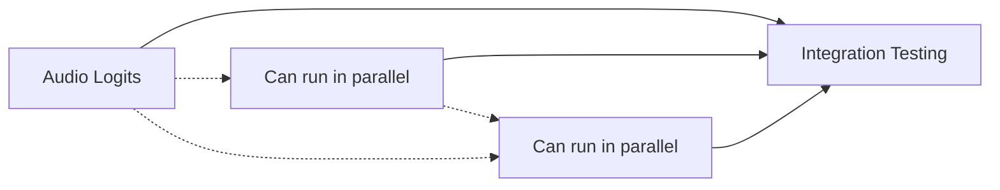
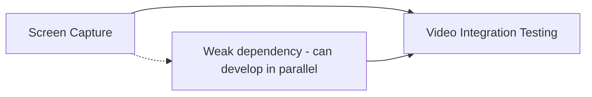

# Milestone Dependencies and Execution Order

**Source Document**: [`TURD.md`](../TURD.md)  
**Analysis Date**: 2025-01-11  
**Total Violations**: 7 production-blocking issues across 3 functional domains  

## Executive Summary

**Optimal Execution Strategy**: PARALLEL EXECUTION with foundational priority

- **Milestone 0**: CRITICAL - Must be completed for full system functionality
- **Milestone 1**: Can run in parallel with Milestone 0 (independent video infrastructure)
- **Milestone 2**: Can run in parallel with both (independent development tooling)

**Total Estimated Timeline**: 4-5 weeks with proper resource allocation

## Dependency Analysis

### 🚨 Milestone 0: Kyutai Language Model Restoration (FOUNDATIONAL)

**Priority**: CRITICAL - Blocks all voice processing functionality  
**Tasks**: 3 violations in `packages/kyutai/src/model.rs`  
**Parallel Potential**: HIGH - All tasks can run concurrently  

#### Internal Task Dependencies


**Execution Strategy**:
- Tasks 0, 1, 2 can be developed by separate developers simultaneously
- Integration testing requires all 3 tasks to be substantially complete
- No blocking dependencies between individual tasks

#### External Dependencies
- **Downstream Impact**: ALL other voice functionality depends on working language model
- **Upstream Dependencies**: None - uses existing Candle framework and dependencies
- **Testing Dependencies**: Requires all 3 tasks complete for full language model testing

### ⚠️ Milestone 1: Video Processing Infrastructure (INDEPENDENT)

**Priority**: HIGH - Affects video features but independent of core voice processing  
**Tasks**: 2 violations in `packages/livekit/src/playback.rs`  
**Parallel Potential**: MEDIUM - Internal dependency between tasks  

#### Internal Task Dependencies


**Execution Strategy**:
- Task 0 (Screen Capture) provides foundation for Task 1 testing
- Both tasks can be developed in parallel with coordination
- Screen capture completion helps validate video frame extraction

#### External Dependencies
- **Downstream Impact**: Video functionality only - no impact on core voice processing
- **Upstream Dependencies**: None - independent video infrastructure
- **Cross-Milestone**: INDEPENDENT of Milestone 0 and 2

### 🔧 Milestone 2: Development Experience Enhancement (INDEPENDENT)

**Priority**: MEDIUM - Improves developer workflow, no runtime impact  
**Tasks**: 1 violation in `packages/cyterm/build.rs`  
**Parallel Potential**: MAXIMUM - Single independent task  

#### Dependencies
- **Internal**: None - single task milestone
- **External**: INDEPENDENT of all other milestones
- **Impact**: Development experience only, no production functionality impact

## Cross-Milestone Dependency Matrix

| From → To | Milestone 0 | Milestone 1 | Milestone 2 |
|-----------|-------------|-------------|-------------|
| **Milestone 0** | ➖ | ⚡ NONE | ⚡ NONE |
| **Milestone 1** | ⚡ NONE | ➖ | ⚡ NONE |  
| **Milestone 2** | ⚡ NONE | ⚡ NONE | ➖ |

**Legend**: 
- ➖ Self (internal dependencies documented above)
- ⚡ NONE = No dependencies, can run in parallel

## Optimal Execution Timeline

### Week 1-2: Parallel Foundation Work
```
┌─ Milestone 0: Language Model ────────────────────────┐
│  - Task 0: Audio Logits (Developer A)               │
│  - Task 1: Tokenizer (Developer B)                  │  
│  - Task 2: Top-K Sampling (Developer C)             │
└──────────────────────────────────────────────────────┘

┌─ Milestone 1: Video Infrastructure ─────────────────┐
│  - Task 0: Screen Capture (Developer D)            │
│  - Task 1: Video Frames (Developer E, coords w/ D) │
└─────────────────────────────────────────────────────┘

┌─ Milestone 2: Development Experience ───────────────┐
│  - Task 0: Wake-word Models (Developer F)          │
└─────────────────────────────────────────────────────┘
```

### Week 3-4: Integration and Testing
```
┌─ Milestone 0: Critical Integration ─────────────────┐
│  - Full language model integration testing         │
│  - End-to-end voice processing validation          │
└─────────────────────────────────────────────────────┘

┌─ Milestone 1: Video Integration ────────────────────┐
│  - Cross-platform video testing                    │
│  - Performance optimization                        │
└─────────────────────────────────────────────────────┘

┌─ Milestone 2: Developer Testing ────────────────────┐
│  - Training workflow validation                    │
│  - Cross-platform build testing                   │
└─────────────────────────────────────────────────────┘
```

### Week 5: System Integration and Deployment
```
┌─ Full System Integration ───────────────────────────┐
│  - All milestones integration testing              │
│  - Performance benchmarking                        │
│  - Production deployment preparation               │
└─────────────────────────────────────────────────────┘
```

## Resource Allocation Recommendations

### Minimum Team: 3 Developers
- **Developer A**: Milestone 0 (all 3 tasks sequentially)
- **Developer B**: Milestone 1 (both tasks)
- **Developer C**: Milestone 2 + testing support

### Optimal Team: 6 Developers
- **Developers A, B, C**: Milestone 0 (parallel task execution)
- **Developers D, E**: Milestone 1 (parallel development with coordination)
- **Developer F**: Milestone 2 + integration testing

### Timeline Compression Options
1. **4-week completion**: Optimal team with focused sprints
2. **6-week completion**: Minimum team with sequential work
3. **3-week completion**: Additional developers + overtime (not recommended)

## Risk Mitigation Strategies

### Critical Path Protection (Milestone 0)
- **Risk**: Language model issues block entire system
- **Mitigation**: Daily stand-ups, frequent integration testing
- **Escalation**: Additional senior developer support if blocked

### Parallel Execution Coordination
- **Risk**: Integration issues between concurrent work
- **Mitigation**: Shared testing environments, regular sync meetings
- **Validation**: Cross-milestone integration testing in weeks 3-4

### Quality Gates
- **Week 2**: All individual tasks pass unit tests
- **Week 3**: Milestone integration tests pass
- **Week 4**: Cross-milestone compatibility verified
- **Week 5**: Production readiness validated

## Success Metrics

**Completion Criteria**:
- [ ] All 7 TURD violations resolved with verified fixes
- [ ] `cargo check --workspace` passes with 0 warnings
- [ ] All integration tests pass across all milestones
- [ ] Performance benchmarks meet real-time constraints
- [ ] Production deployment checklist 100% complete

**Quality Metrics**:
- [ ] >80% test coverage on all new code
- [ ] <10ms latency for voice processing pipeline
- [ ] <50ms latency for video capture pipeline  
- [ ] 100% success rate on cross-platform builds

This dependency analysis enables optimal parallel execution while ensuring proper integration and quality throughout the implementation process.